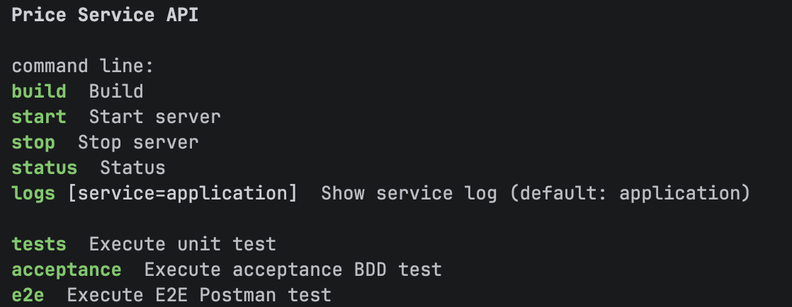
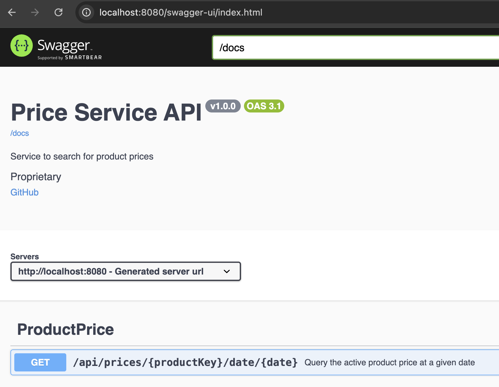
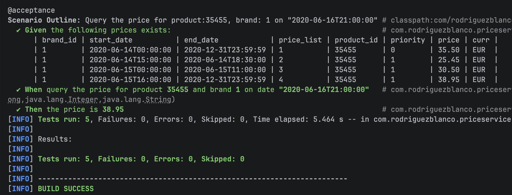
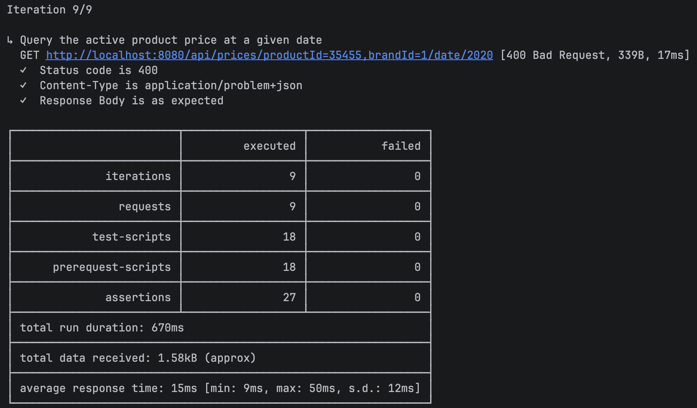

# Product Price Service API

The goal of Product Price Service API is to provide the active product price on a given date.

It is based in hexagonal architecture, message buses and DDD. The application layer (inside the hexagon) is
framework-agnostic and pure java, this applies to the domain and also to the application services and ports.
As input or user-side ports we have a Query and a Command Bus. As output or server-side ports there is
a repository, to retrieve data from persistence.
The application also have Event and Message Bus ports, unused in this case,
because there is no functional requirement to implement those. The message bus adapters implementations are also
framework-agnostic. The Spring Boot framework provides the beans of the message buses registering the
handlers for their respective commands or queries in the configuration. Spring MVC is used for the rest adapter
providing a controller to receive GET requests. There is a global exception handler to provide mapping for
domain exceptions to RFC 9457 problem detail.
As persistence adapter the implementation of the repository port is based on Spring JPA.
The acceptance testing is based on BDD with cucumber and Spring RestTestClient. The API provides OpenApi documentation
and a Postman collection, which is used to execute the E2E contract tests.

## Architecture

This project is based on hexagonal architecture, messages buses and DDD.

### Hexagonal Architecture

The Hexagonal Architecture pursues two main objectives:
1. It allows a software application to be driven by different actors.
2. It allows an application to be developed and tested in isolation from its run-time devices and databases.

A software **application** tries to solve a business problem, it has context, rules and constraints.
This particular definition is what we called *business logic*. To understand the business logic you don't
have to be a technical person, only to have some knowledge or role in the domain area this logic belongs to (e.g.,
logistics, people, marketing).

The user of the application could be a person behind a web interface, another software system in a distributed
environment, a mobile application, a testing suite, etc. The important fact here is that the business logic,
implemented by our application, could be used by different actors each with its own user interface or implementation
technology. This is the **user-side** of the system, also known as *primary*, *driving* or *input*. The idea behind
these terms is that someone initiates the conversation with the application.

The application often has to retrieve or save data in a persistent store, dispatch messages to notify the changes
to other systems, or call external web services among other scenarios. This is the **server-side**, also known as
*infrastructure*, *secondary*, *driver* or *output*.


The both parts, user-side and server-side, are external to our application, where the business logic resides.
The application provides the abstraction of ports to interface with the external systems and adapters being the
concrete implementation of those abstractions.

The advantages of applications which uses Hexagonal Architecture are:
- They are loose-coupled systems implementing the business logic only inside the application.
- It makes it easier to test the application.
- It makes it easier to execute the application by different actors.
- It allows to develop the application without external servers.
- It makes it easier to change the external infrastructure or technology.

### CQS

CQS stands for Command Query Separation. The fundamental idea is to separate the object's methods
in two categories:
- **Queries**: Return a result and do not change the state of the system.
- **Commands**: Change the state of the system. They could or not return a result.

We will apply this principle in the design of the **Application Services** use cases. Everything will be
a command or a query.

### Message Buses

A **bus** is an information (**message**) transmission system. This abstraction can be used in event based architectures
or as a loose coupling mechanism. The idea is that we have several systems which communicates through messages.
Those messages will be dispatched to a bus (communication channel) and there will be handlers which receives those messages.

We will define the following buses:
- **Query Bus**: used to fetch data from the system.
- **Command Bus**: used to execute **_actions_**, they change the state of the entities in the system.
- **Event Bus**: used to notify the domain events, **_reactions_**. (Event Sourcing | Event Store)
- **Message Bus**: used to send messages to external systems.


## Requirements

The requirements to execute the project are:

1. Podman or Docker
2. Make

> :information_source:
> In Windows environments you can install make from the Command Prompt or PowerShell with Chocolatey package manager:
>
> ```shell
> choco install make
> ```

## Configuration

By default, the container runtime is set to podman, but you can change it editing the [Makefile](Makefile):

**Docker**
```makefile
CONTAINER_RUNTIME := docker
```

**Podman**
```makefile
CONTAINER_RUNTIME := podman
```

## Usage

To ease the work with the project there is a Makefile. Show the available commands with

```shell
make
```

This will show



### Run the service
```shell
make start
```

### Use the API

Once the service is running the OpenApi documentation will be in the links:
- Web (Swagger): [http://localhost:8080/swagger-ui/index.html](http://localhost:8080/swagger-ui/index.html)
- JSON: [http://localhost:8080/api-docs](http://localhost:8080/api-docs)
- YAML: [http://localhost:8080/api-docs.yaml](http://localhost:8080/api-docs.yaml)



### Testing

#### Acceptance BDD testing
To run the acceptance tests from terminal, do the following:
```shell
make acceptance
```
The report in the terminal should show:


**Acceptance Test**
```gherkin
Feature:
  As a user,
  I want to query for a product on a specific date,
  so I can find out the current selling price at that time.

  Background:
    Given the following prices exists:
      | brand_id | start_date          | end_date            | price_list | product_id | priority | price | curr |
      | 1        | 2020-06-14T00:00:00 | 2020-12-31T23:59:59 | 1          | 35455      | 0        | 35.50 | EUR  |
      | 1        | 2020-06-14T15:00:00 | 2020-06-14T18:30:00 | 2          | 35455      | 1        | 25.45 | EUR  |
      | 1        | 2020-06-15T00:00:00 | 2020-06-15T11:00:00 | 3          | 35455      | 1        | 30.50 | EUR  |
      | 1        | 2020-06-15T16:00:00 | 2020-12-31T23:59:59 | 4          | 35455      | 1        | 38.95 | EUR  |

  Scenario Outline: Query the price for product:<productId>, brand: <brandId> on <date>
    When query the price for product <productId> and brand <brandId> on date <date>
    Then the price is <expectedPrice>

    Examples:
      | productId | brandId | date                  | expectedPrice |
      | 35455     | 1       | "2020-06-14T10:00:00" | 35.50         |
      | 35455     | 1       | "2020-06-14T16:00:00" | 25.45         |
      | 35455     | 1       | "2020-06-14T21:00:00" | 35.50         |
      | 35455     | 1       | "2020-06-15T10:00:00" | 30.50         |
      | 35455     | 1       | "2020-06-16T21:00:00" | 38.95         |
```

#### E2E contract testing

There is a [postman collection](/src/test/postman/postman_collection.json) and a
[dataset](/src/test/postman/e2e_postman_dataset.json) in /src/test/postman.

In order to run e2e/contract tests execute the following command from the terminal:
```shell
make e2e
```

Then you should view the report as shown below:



The dataset includes the input variables and the expected results for each test case: the response
status code, content-type header and body as is shown in this example:

```json
{
    "productKey": "productId=35455,brandId=1",
    "date": "2020-06-14T10:00:00Z",
    "expectedStatus": 200,
    "expectedContentTypeHeader": "application/json",
    "expectedResponseBody": {
      "productId": 35455,
      "brandId": 1,
      "priceList": 1,
      "from": "2020-06-14T00:00:00",
      "to": "2020-12-31T23:59:59",
      "sellingPrice": 35.5,
      "currency": "EUR"
    }
  }
```

The dataset has the 5 use cases from the [problem statement](doc/problem_statement.md) and also the error cases for 404 and 400 responses.

The testing code included in the post-response scripts is:

```javascript
var expectedStatus = parseInt(pm.collectionVariables.get("expectedStatus"));
var expectedContentTypeHeader = pm.collectionVariables.get("expectedContentTypeHeader");
var expectedResponseBody = JSON.parse(pm.collectionVariables.get("expectedResponseBody"))

pm.test(`Status code is ${expectedStatus}`, function () {
    pm.expect(expectedStatus).to.eql(pm.response.code)
});
pm.test(`Content-Type is ${expectedContentTypeHeader}`, function () {
    pm.response.to.have.header("Content-Type")
    pm.expect(expectedContentTypeHeader).to.eql(pm.response.headers.get("Content-Type"))
});
pm.test("Response Body is as expected", function () {
    var actualResponseBody = pm.response.json();
    pm.expect(expectedResponseBody).to.eql(actualResponseBody);
});
```

There is also code to set the expectations for each iteration in the pre-request script:
```javascript
// Defaults
var expectedStatus = 200
var expectedContentTypeHeader = "application/json"
var expectedResponseBody = {"productId":35455,"brandId":1,"priceList":1,"from":"2020-06-14T00:00:00","to":"2020-12-31T23:59:59","sellingPrice":35.5,"currency":"EUR"}

// If has iterationData update vars
var iterationData = pm.iterationData.toObject();
if (iterationData != null) {
    expectedStatus = iterationData.expectedStatus
    expectedContentTypeHeader = iterationData.expectedContentTypeHeader
    expectedResponseBody = iterationData.expectedResponseBody
}
// Set values
pm.collectionVariables.set("expectedStatus", expectedStatus);
pm.collectionVariables.set("expectedContentTypeHeader", expectedContentTypeHeader);
pm.collectionVariables.set("expectedResponseBody", JSON.stringify(expectedResponseBody));

```

## Documentation

- [Problem statement](doc/problem_statement.md)
- [OpenApi specification](src/main/resources/static/doc/api/openapi/openapi.yaml)

# Resources

- [Spring Boot](https://docs.spring.io/spring-boot/index.html)
- [Cucumber](https://cucumber.io/docs)
- [Postman](https://www.postman.com/)
- [Newman](https://learning.postman.com/docs/collections/using-newman-cli/command-line-integration-with-newman/)
- [RFC 9457 - Problem Details for HTTP APIs](https://datatracker.ietf.org/doc/html/rfc9457)
- [Podman](https://podman.io/)