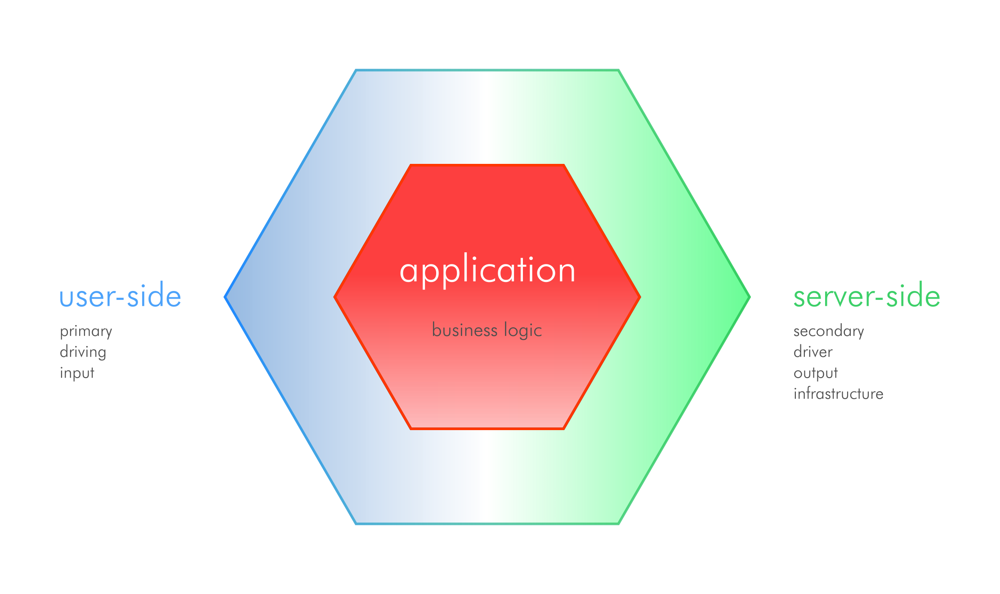
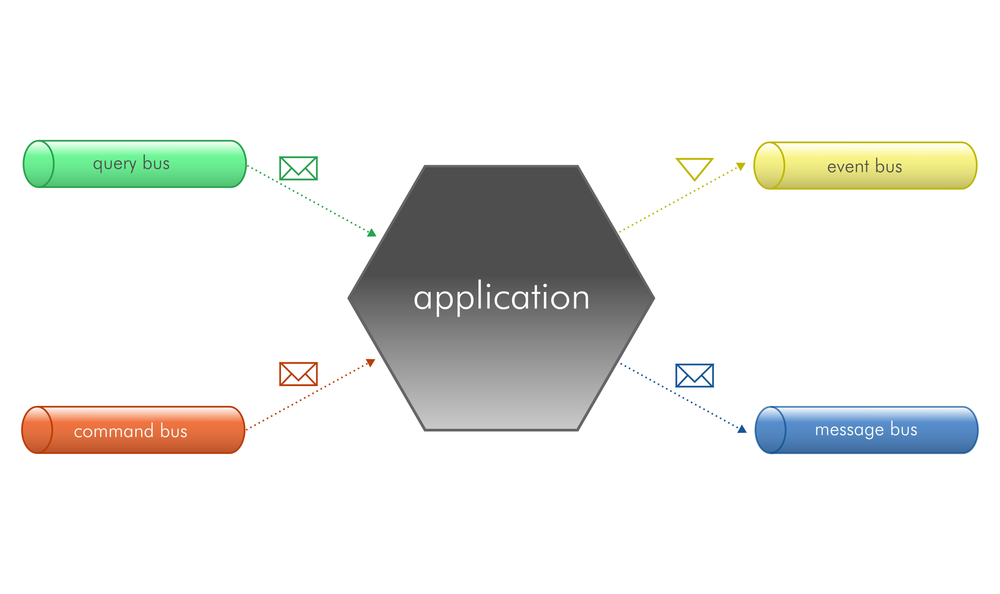

# Architecture

This project is based on hexagonal architecture, messages buses and DDD.

## Hexagonal Architecture

The Hexagonal Architecture pursues two main objectives:
1. It allows a software application to be driven by different actors.
2. It allows an application to be developed and tested in isolation from its run-time devices and databases.

A software **application** tries to solve a business problem, it has context, rules and constraints.
This particular definition is what we called *business logic*. In order to understand the business logic you don't
have to be a technical person, only to have some knowledge or role in the domain area this logic belongs to (e.g.,
logistics, people, marketing).

The user of the application could be a person behind a web interface, another software system in a distributed
environment, a mobile application, a testing suite, etc. The important fact here is that the business logic,
implemented by our application, could be used by different actors each with its own user interface or implementation
technology. This is the **user-side** of the system, also known as *primary*, *driving* or *input*. The idea behind
these terms is that someone initiates the conversation with the application.

The application often has to retrieve or save data in a persistent store, dispatch messages to notify the changes
to other systems, or call external web services among other scenarios. This is the **server-side**, also known as
*infrastructure*, *secondary*, *driver* or *output*.

The both parts, user-side and server-side, are external to our application, where the business logic resides.
The application provides the abstraction of ports to interface with the external systems and adapters being the
concrete implementation of those abstractions.

The advantages of applications which uses Hexagonal Architecture are:
- They are loose-coupled systems implementing the business logic only inside the application.
- It makes it easier to test the application.
- It makes it easier to execute the application by different actors.
- It allows to develop the application without external servers.
- It makes it easier to change the external infrastructure or technology.

## CQS

CQS stands for Command Query Separation. The fundamental idea is to separate the object's methods
in two categories:
- **Queries**: Return a result and do not change the state of the system.
- **Commands**: Change the state of the system. They could or not return a result.

We will apply this principle in the design of the **Application Services** use cases. Everything will be
a command or a query.

## Message Buses

A **bus** is an information (**message**) transmission system. This abstraction can be used in event based architectures
or as a loose coupling mechanism. The idea is that we have several systems which communicates through messages.
Those messages will be dispatched to a bus (communication channel) and there will be handlers which receives those messages.

We will define the following buses:
- **Query Bus**: used to fetch data from the system.
- **Command Bus**: used to execute **_actions_**, they change the state of the entities in the system.
- **Event Bus**: used to notify the domain events, **_reactions_**. (Event Sourcing | Event Store)
- **Message Bus**: used to send messages to external systems.

