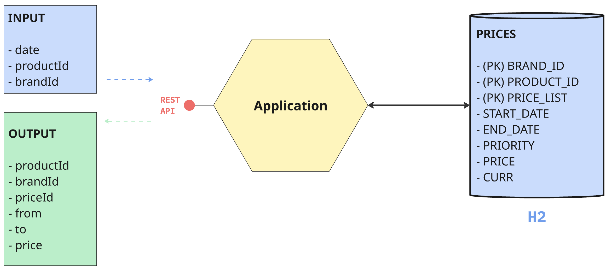

En la base de datos de comercio electrónico de la compañía disponemos de la tabla `PRICES` que refleja el precio final (pvp) y la tarifa que aplica a un producto de una cadena entre unas fechas determinadas. A continuación se muestra un ejemplo de la tabla con los campos relevantes:

| <small>BRAND_ID |     <small>START_DATE      |      <small>END_DATE       | <small>PRICE_LIST</small> | <small>PRODUCT_ID</small> | <small>PRIORITY</small> | <small>PRICE</small> | <small>CURR</small> |
|:---------------:|:--------------------------:|:--------------------------:|:-------------------------:|:-------------------------:|:-----------------------:|:--------------------:|:-------------------:|
|    <small>1     | <small>2020-06-14-00.00.00 | <small>2020-12-31-23.59.59 |         <small>1          |       <small>35455        |        <small>0         |     <small>35.50     |     <small>EUR      |
|    <small>1     | <small>2020-06-14-15.00.00 | <small>2020-06-14-18.30.00 |         <small>2          |       <small>35455        |        <small>1         |     <small>25.45     |     <small>EUR      |
|    <small>1     | <small>2020-06-15-00.00.00 | <small>2020-06-15-11.00.00 |         <small>3          |       <small>35455        |        <small>1         |     <small>30.50     |     <small>EUR      |
|    <small>1     | <small>2020-06-15-16.00.00 | <small>2020-12-31-23.59.59 |         <small>4          |       <small>35455        |        <small>1         |     <small>38.95     |     <small>EUR      |
**Campos**

- *BRAND_ID*: foreign key de la cadena del grupo (1 = ****).
- *START_DATE, END_DATE*: rango de fechas en el que aplica el precio tarifa indicado.
- *PRICE_LIST*: Identificador de la tarifa de precios aplicable.
- *PRODUCT_ID*: Identificador código de producto.
- *PRIORITY*: Desambiguador de aplicación de precios. Si dos tarifas coinciden en un rango de fechas se aplica la de mayor prioridad (mayor valor numérico).
- *PRICE*: precio final de venta.
- *CURR*: iso de la moneda.

**Servicio**

Construir una aplicación/servicio en **SpringBoot** que provea un **endpoint rest de consulta** tal que:

- Acepte como parámetros de **entrada**: fecha de aplicación, identificador de producto, identificador de cadena.
- Devuelva como datos de **salida**: identificador de producto, identificador de cadena, tarifa a aplicar, fechas de aplicación y precio final a aplicar.

- Se debe utilizar una **base de datos en memoria (tipo h2)** e inicializar con los datos del ejemplo, (se pueden cambiar el nombre de los campos y añadir otros nuevos si se quiere, elegir el tipo de dato que se considere adecuado para los mismos).

**Tests de Aceptación**

Desarrollar unos test al endpoint rest que validen las siguientes peticiones al servicio con los datos del ejemplo:

- Test 1: petición a las 10:00 del día 14 del producto 35455 para la brand 1 (****)  
- Test 2: petición a las 16:00 del día 14 del producto 35455 para la brand 1 (****)  
- Test 3: petición a las 21:00 del día 14 del producto 35455 para la brand 1 (****)  
- Test 4: petición a las 10:00 del día 15 del producto 35455 para la brand 1 (****)  
- Test 5: petición a las 21:00 del día 16 del producto 35455 para la brand 1 (****)

**Se valorará**

1. Diseño y construcción del servicio.
2. Calidad de Código.
3. Resultados correctos en los test.

